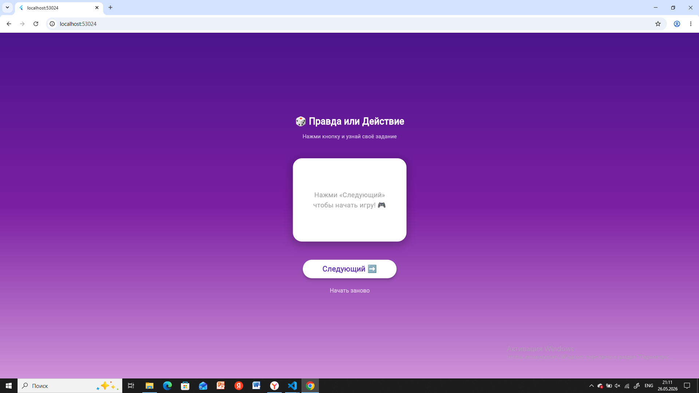
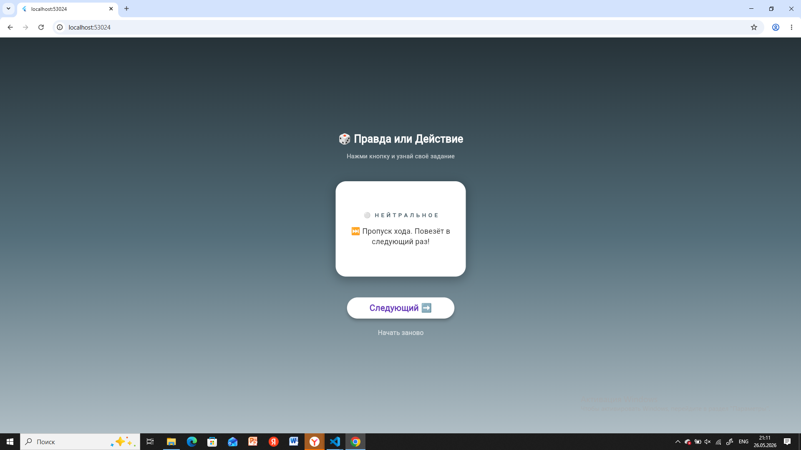
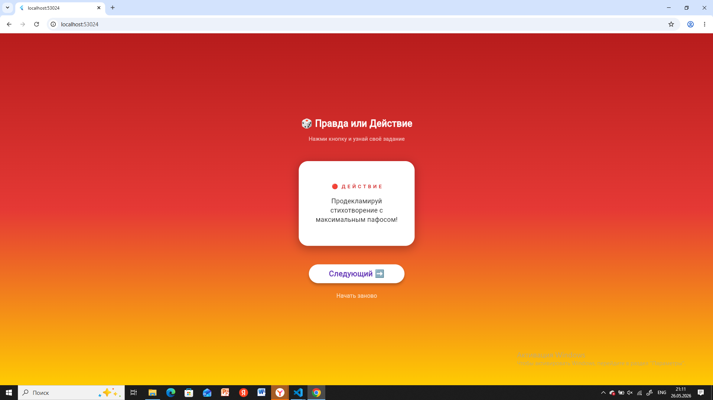
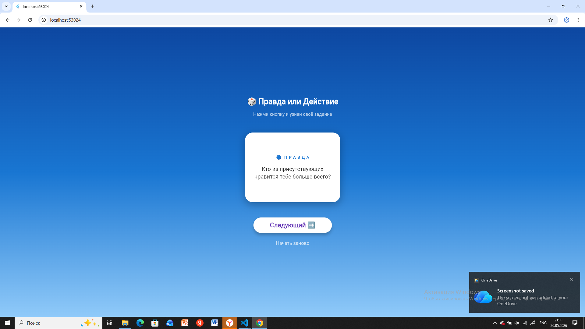

# Игра «Правда или Действие» на Flutter
Анимационное мобильное приложение для компании друзей, разработанное на Flutter. Помогает весело провести время, отвечая на каверзные вопросы или выполняя забавные задания.
## Особенности проекта
 * **Три категории карточек:** 🔵 Правда, 🔴 Действие и ⚪ Нейтральные события (пропуск хода, выбор задания и т.д.).
 * **Плавные «умные» анимации:** При смене карточки фон плавно переливается в цвет текущей категории, а сама карточка переворачивается через мягкое исчезновение и появление.
 * **Защита от спама:** Кнопка «Следующий» блокируется на время анимации, чтобы игрок случайно не пропустил своё задание.
 * **Сброс игры:** Возможность в любой момент вернуться на начальный экран и начать заново.
## Структура проекта
```text
lib/
├── main.dart          # Точка входа в приложение, настройка Scaffold
├── game_screen.dart   # Главный экран (управление состоянием, фоном и таймингом анимаций)
├── card_widget.dart   # Визуальный виджет карточки (отвечает за дизайн и тени)
└── game_data.dart     # База данных (список вопросов) и генератор случайных карт

```
## Как запустить проект локально
 1. Убедиться, что у тебя установлен Flutter.
 2. Склонируй или создай проект и перейди в его папку:
   ```bash
   cd truth_or_dare
   
   ```
 3. Запусти сборку в браузере Chrome или на эмуляторе/смартфоне:
   ```bash
   flutter run
   
   ```
## Скрины работы





## Автор
Черкина Дарья ИСП-231